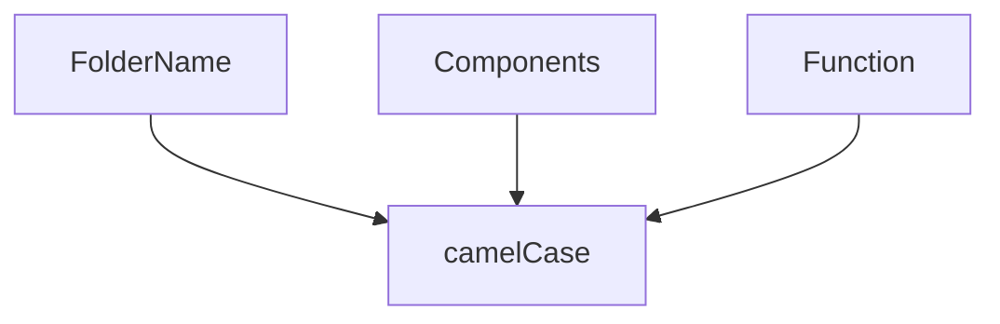

<!-- @format -->

# ostigan-monorepo

## Cloning and Running the Application in local

> Clone the project into local

```bash
 git clone http://172.21.21.15:8000/ngrcode/ostigan-monorepo.git
```

> Install all the yarn packages. Go into the ostigan-monorepo folder and type the following command to install all yarn packages

```bash
yarn add -W
```

> Install packages

```bash
yarn add -W [packageNAme]
```

> In order to run the application Type the following command

> start client & admin

```bash
yarn dev
```

> start client

```bash
yarn dev --scope=client

OR

yarn dev:client
```

> start admin

```bash
yarn dev --scope=admin

OR

yarn dev:admin
```

> start storybook

```bash

yarn workspace story-document storybook

```

## Folder Structure

> Folder structure

```
├── ostigan-monorepo
        ├── admin
        │    ├── public
        │    ├── src
        │    │   ├── app
        │    │   │    ├──(Dashboard)
        │    │   │    │    ├── Route1
        │    │   │    │    │     ├── loading.tsx
        │    │   │    │    │     └── page.tsx
        │    │   │    │    └── Route2
        │    │   │    │          ├── loading.tsx
        │    │   │    │          └── page.tsx
        │    │   │    ├── favicon.ico
        │    │   │    ├── globals.css
        │    │   │    ├── layout.tsx
        │    │   │    └── page.tsx
        │    │   ├── views
        │    │   │    ├── Route1
        │    │   │    │    ├── part1
        │    │   │    │    │     ├── view.tsx
        │    │   │    │    │     └── viewModel.ts
        │    │   │    │    ├── part2
        │    │   │    │    |     ├── view.tsx
        │    │   │    |    |     └── viewModel.tsx
        │    │   │    |    ├── imports.ts
        │    │   │    |    └── index.ts
        |    |   |    └── Route2
        │    │   │         ├── view.tsx
        │    │   │         ├── viewModel.ts
        │    │   │         ├── imports.ts
        │    │   │         └── index.ts
        │    │   ├── components
        │    │   |    ├── form
        │    │   |    ├── element
        │    │   |    ├── tables
        │    │   |    ├── loader
        |    |   |    |    ├── skeleton.ts
        |    |   |    |    └── loading.ts
        |    |   |    |
        │    │   |    └──
        │    │   ├── configs
        │    │   ├── hooks
        │    │   ├── context
        │    │   ├── lib
        │    │   └── consts
        |    ├──.eslintrc.json
        |    ├──.gitignore
        |    ├── next.config.js
        |    ├── package-lock.json
        |    ├── postcss.config.js
        |    ├── tailwind.config.ts
        |    └── tsconfig.json
        ├── client
        │    ├── public
        │    ├── src
        │    │   ├── app
        │    │   │    ├──(Dashboard)
        │    │   │    │    ├── Route1
        │    │   │    │    │     ├── loading.tsx
        │    │   │    │    │     └── page.tsx
        │    │   │    │    └── Route2
        │    │   │    │          ├── loading.tsx
        │    │   │    │          └── page.tsx
        │    │   │    ├── favicon.ico
        │    │   │    ├── globals.css
        │    │   │    ├── layout.tsx
        │    │   │    └── page.tsx
        │    │   ├── views
        │    │   │    ├── Route1
        │    │   │    │    ├── part1
        │    │   │    │    │     ├── view.tsx
        │    │   │    │    │     └── viewModel.ts
        │    │   │    │    ├── part2
        │    │   │    │    |     ├── view.tsx
        │    │   │    |    |     └── viewModel.ts
        │    │   │    |    ├── imports.ts
        │    │   │    |    └── index.ts
        |    |   |    └── Route2
        │    │   │         ├── view.tsx
        │    │   │         ├── viewModel.ts
        │    │   │         ├── imports.ts
        │    │   │         └── index.ts
        │    │   ├── components
        │    │   |    ├── form
        │    │   |    ├── element
        │    │   |    ├── tables
        │    │   |    ├── loader
        |    |   |    |    ├── skeleton.ts
        |    |   |    |    └── loading.ts
        |    |   |    |
        │    │   |    └──
        │    │   ├── configs
        |    |   |    ├── httpServise
        |    |   |    |    ├── axios.ts
        |    |   |    |    └── reactQuery.ts
        |    |   |    |
        │    │   |    └──
        │    │   ├── hooks
        │    │   ├── context
        │    │   ├── lib
        │    │   └── consts
        |    ├──.eslintrc.json
        |    ├──.gitignore
        |    ├── next.config.js
        |    ├── package-lock.json
        |    ├── postcss.config.js
        |    ├── tailwind.config.ts
        |    └── tsconfig.json
        ├── components
        │    ├── icons
        │    ├── form
        │    ├── element
        │    ├── tables
        │    ├── loader
        |    |    ├── skeleton.ts
        |    |    └── loading.ts
        |    |
        │    └──
        ├── configs
        │    ├── themes.ts
        │    ├── .prettierrc.json
        │    └── tailwind.config.ts
        ├── .gitignore
        ├── package.json
        └── README.md
```

## Conventions



## projects Guideline

- Programming Language : ([TypeScript](https://www.typescriptlang.org/)).
- Framwork :([ Next.js ](https://nextjs.org/)).
- Data Fetching : React Query and Axios .
- State Manager : Context .
- Styling : ([Tailwind CSS](https://tailwindcss.com/docs/installation)) and ([Material UI](https://mui.com/)).
- Testing : Jest, Cypress .
- Mobile-First Approach : Progressive Web Apps(PWA).
- Offline Mode : indexeddb .
- Version Contorole: GitLab with GitFlow .
- Integration and Deployment : Docker, CI/CD pipeline .
- package MAnager : Yarn
- internalise : next-intl([next-intl](https://next-intl-docs.vercel.app/)).
- monitoring Tools : Sentry .

## Team Members


<p  align="center">

<a href="https://github.com/mohammadtakhtkeshha">
         
</a>

<a href="https://github.com/memehri-a71">
         
</a>

<a href="http://172.21.21.15:8000/ngrcode">
         
</a>

</p>


> > > > > > >
